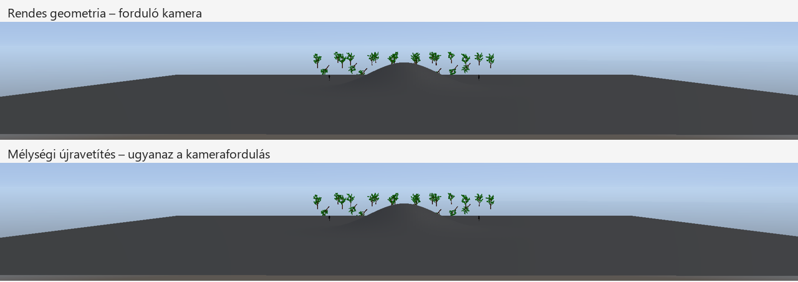

# Impostorok kamerafordulás közben – 2026-10-10

A jelenetszintű GPU-impostor most kis kamerafordulás közben is újrafelhasználható. Ez a távoli opaque/masked objektumokra, a terrainre és az animált karakterekre egyaránt érvényes, a Scene View-ban, Game View-ban és az editor nélküli runtime-ban. Az előre készített modellatlasz továbbra is külön út.

## Támogatott kameramozgás

A kamera helyének változatlanul kell maradnia. Az új kamera sugaraiból kiszámítjuk, melyik rögzített pixelhez tartoznak, majd annak színét és mélységét mintavesszük. A mélységet az új kamera koordinátáira is átalakítjuk; az előző kamera mélységének egyszerű visszaírása hibás takarást okozna.

| Feltétel | Viselkedés |
|---|---|
| Változatlan kamera | Eredeti, közvetlen pixelmásolás |
| Azonos helyről kis körbenézés | Szín- és mélységi újravetítés |
| Rögzített képhez képest 2°-nál nagyobb előreirány-változás | Új capture vagy rendes geometria |
| A teljes új képkivágás sugarai nem férnek a régi képbe | Új capture vagy rendes geometria; nem marad hiányzó terület |
| A forrás és cél helyi pixelmérete több mint 5%-kal eltér | Új capture vagy rendes geometria |
| Kamera helyváltozása, orbitálás, közeli/távoli vágósík változása | Geometria; megállás után új kalibráció |
| Ortografikus, hibás vagy szinguláris kamera | Geometria |
| Célkép/nézetméret változása | Cache érvénytelenítése, új képek |

A 2° a kép készítése óta felhalmozott változásra vonatkozik, nem a fordulás összesített korlátja. Hosszabb körbenézésnél a képek frissülnek. Nagy, egyetlen frame alatti nézetváltás szintén megszakítja a kalibrációt. A statikus képek legfeljebb 100 ms, a karakterképek legfeljebb 16,67 ms életkorúak maradnak.

A kamera helyváltozásának tiltása szándékos: egyetlen korábbi mélységképből nem ismerjük a mögötte feltáruló felületeket. Ez még nem sétáló kamerát kiszolgáló terrain/karakter HLOD. Az előre bake-elt statikus modellatlasz kameramozgás alatti működése megmarad.

## Kivágás, memória és terrain-határok

A rögzített kép nyolcpixeles szegélyt kap, mérete 16 pixeles lépésekre kerekül. A képkivágás változásakor az allokáció újra használható, ha az új kivágás belefér. A viewport/scissor eredeti pixelméretben dolgozik; nincs alacsony felbontású kép felnagyítása. Az egyedi megjelenített kivágás korlátja továbbra is 256 × 256, a rögzített allokáció a szegéllyel legfeljebb 288 × 288. Az összevont terrain-sáv a nézet szélességéig terjedhet.

A terrain rögzítése a kivágásban a látható natív chunkokat is rajzolja. Csak a távoli csoportot helyettesítjük; a közeli chunkok a fő passban továbbra is geometriaként jelennek meg. Ez folytonos szín-/mélységképet ad a natív és cache-elt terrain határán, ahol az egész pixeles mintavétel különben vékony réseket okozott. A frissítés plusz vertexmunkával járhat; az automatikus választás ezt is a teljes frame-időben méri. A kiváltott háromszögek száma csak a helyettesített távoli chunkokat számolja.

A tényleges GPU-képallokációk 64 MiB-os kerete, a 16 capture/frame és 512 bejegyzés korlátja megmarad. A folyamatban levő parancsok által használt képeket továbbra sem szabadítjuk fel korán.

## Numerikus és minőségi feltételek

A CPU a sorvektoros `H = inverse(currentVP) * captureVP` leképezést dupla pontossággal állítja elő, a közös kamerahelyhez viszonyítva. A deklarált szempozíciót a perspektivikus mátrix optikai középpontjával ellenőrizzük. A világkoordinátás float mátrix transzlációs sorának kis XY/W kerekítési hibáját korrigáljuk; a tényleges Z-értéket megőrizzük. A cél Z-jét a shader az előző mélység és H alapján oldja meg. A shader push constant mérete 112 byte.

A teljes célkivágás négy sarkának forrássugarát és helyi pixelméretét ellenőrizzük. Pozitív homogén W mellett a belső sugarak a sarkok által határolt területen belül maradnak. A nem lefedett kivágás nem kerül vissza részleges impostorként.

A nearest mintavétel miatt a távoli sziluett és alfa-kivágás nem minden fordulásnál pixelazonos a frissen raszterizált geometriával. A korábban rögzített, nézetfüggő materialszín is közelítés, ezért van a kis szög és életkor korlátja. A víz, részecske, Blend felület, árnyék és tükröződés lefedettsége ebben a lépésben nem bővült.

## Kapcsolók és megfigyelés

- `IX_SCENE_IMPOSTORS=0`: GPU-s út kikapcsolva.
- `IX_SCENE_IMPOSTORS=1`, illetve hiányzó változó: automatikus választás, legalább 2% teljes frame-nyereség szükséges.
- `IX_SCENE_IMPOSTORS=2`: kényszerített mód, a geometriai és memóriafeltételek továbbra is érvényesek.
- `IX_TREE_IMPOSTORS=0`: a külön előre készített modellatlasz kikapcsolása.

A Performance panel **Reprojected impostors** sora és a `[VIEW-IMPOSTOR] reprojected=...` napló az adott frame-ben újravetített objektumok, terrain-chunkok és karakterek összesített számát mutatja. Ez forráselemek száma, nem GPU draw call. Scene és Game összeadódik. Közvetlen pixelmásolás vagy új capture nem növeli ezt a számlálót.

Kis, folyamatos körbenézés már nem nullázza minden frame-ben az automatikus kalibrációt. Kameraelmozdulás, nagy vetítésváltozás, fényváltozás és hosszabb szünet továbbra is új mérést kér. A könnyű, CPU-limitált jelenetben az automatikus mód választhat rendes geometriát.

## Képi ellenőrzés

Saját dombos tesztjelenetben 24 statikus modell, 3 animált karakter és 24 helyettesített terrain-chunk rajzolódott körbenézés közben. Az újravetített forráselemek száma egy frissítés nélküli frame-ben 51 volt. A kameramozgatás külön szakasza elmozdulást, megállást és objektumtranszformáció-változást is gyakorolt.

A terrain-határ javítása után a kikapcsolt rendszer és az újravetítés 1000. és 1600. frame-jét hasonlítottuk össze, azonos frame-hez kötött kamerafordulással. A vizsgált homogén terrain-belső 78 340, illetve 74 374 pixelén nulla 24/255-nél nagyobb színeltérés maradt. Ez a teszt a terrain belső réseit ellenőrzi; nem állít pixelazonosságot textúrázott materialokra, sziluettekre vagy eltérő időpillanatban mintavett animációra.

A saját fixture, mérőszkriptek és képek a `Client/build/rotation-impostor-audit-20261010/` könyvtárban vannak. Az ideiglenes mozgatási és GPU-képolvasási kód nem része a végleges renderernek.

## Teljesítmény folyamatos körbenézés közben

Mindegyik futás 22 másodperces Release runtime, 2560 × 1369 felbontás, bekapcsolt async present mellett. A kamera helye állandó, a yaw/pitch időalapúan, folyamatosan változik; az amplitúdó 0,01/0,004 radián. A fák előre készített atlasza ki volt kapcsolva, hogy a GPU-s út önálló hatását mérjük. Nem futott build vagy teszt a mérési ablakokban. Az eredmények az utolsó öt mérési ablak mediánjai.

| Mutató | GPU-impostor kikapcsolva | Automatikus mód |
|---|---:|---:|
| 1024 × 1024 cellás terrain + 24 modell + 3 animált karakter, FPS | 970 | 1110 |
| Ugyanott CPU frame | 1,030 ms | 0,900 ms |
| Ugyanott CPU render | 0,140 ms | 0,251 ms |
| Ugyanott jelenet GPU | 0,509 ms | 0,367 ms |
| Ugyanott terrain GPU | 0,378 ms | 0,303 ms |
| Könnyebb, 256 × 256 cellás dombos jelenet, FPS | 1497 | 1496 |
| Ugyanott jelenet GPU | 0,237 ms | 0,237 ms |

A nagy jelenetben a választás `calibrating → trial → enabled`, és az FPS-nyereség **14,4%**. A könnyű jelenetben mindkét próbánál `geometry` lett az eredmény, a két futás FPS-eltérése −0,1% körüli. A gyorsabb GPU mellett is nőhet a CPU-költség; ezért az automatikus mód továbbra is szükséges. Ezek saját tesztjelenetek eredményei, nem általános FPS-garanciák és nem üres-editor mérések.

A nyers naplók: `Client/build/followup-audit-20261008/view-impostor-rotation-adaptive-{group,light}-{off,on}-20261010/`. Az összegző szkript és `metrics.json` a fenti auditkönyvtárban található.

## Automatikus és natív ellenőrzés

A tesztkód eltávolítása után az editor és editor nélküli runtime végleges Debug/Release buildje egyaránt sikeres. Mind a négy konfigurációban **12/12 CTest sikeres**. A GPU-képolvasás és kameramozgatás ideiglenes forrásmódosításai byte-pontosan visszaálltak; a végleges binárisok már ezeket nem tartalmazzák. A diff whitespace-ellenőrzése is sikeres.

A `ViewImpostorTest` 54 ellenőrzést tartalmaz. Új esetek a közös kamerahely, yaw/pitch, nem nulla világkoordinátás kamera, identitás, transzláció, túl nagy szög, hibás optikai középpont, ortografikus/szinguláris/NaN vetítés, vágósík-változás, hiányos képlefedés és a túlzott nagyítás. A forráspixelt és célmélységet több világpontnál független, közvetlen geometriai vetítéssel hasonlítja össze.

A végleges terrain-határjavítással készült instrumentált Debug runtime 22 másodperces, kényszerített futása hibamentesen zárult. A Vulkan- és szinkronizáció-validáció nem jelzett VUID, SYNC-HAZARD vagy Validation Error hibát. Az elmozdulás szakaszában nincs impostorhasználat; az objektummozgatás szakaszában új képek készülnek. Napló: `view-impostor-rotation-final-validation-20261010` a fenti nyersnapló-könyvtárban.

Az alaparchitektúra, material- és renderút-korlátok, valamint a korábbi álló kamerás mérések: [jelenetszintű impostorok](scene-impostors-20261009.md).
