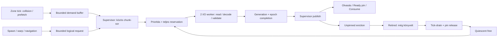

# Streaming admission/liveness — SL-0 + SL-1 review

> Történeti SL-0/SL-1 R3 jelentés. Az alábbi megállási státusz az akkori állapot; az azóta jóváhagyott SL-2 munkát a [külön SL-2 review](map-streaming-sl2-review.md) dokumentálja. A történeti eredmények változatlanok.

Munkafázis: **SL-0 + SL-1 befejezve; STOP / review. SL-2 nincs elkezdve.**
A végső eredmény az R3; a köztes futások történeti bizonyítékok.

- **Reprodukált ok:** a folyamatos háttérigény újította a soft retentiont,
  miközben a terrain-sor telített volt. A 16 MiB-os keretben az adott
  belépési művelet fizikailag elfért; nem szükséges kapacitáshiány okozta
  az elakadást. Az eredeti trace-ben volt quiescent előrehaladás.
- **Javítás:** bounded műveleti kérés/handoff, prioritás és pressure eviction
  a meglévő streamerben; snapshotfüggetlen, pinbiztos reclamation a meglévő
  runtime-gate segítségével. Memóriahatár és eredeti timeout változatlan.
- **Elfogadás:** eredeti hotspot és border PASS. Movingban az admission és
  mindhárom áthelyezés sikeres, de **a teljes eset FAIL**, mert a mérési
  ablakban nincs eviction. Nincs mesterséges PASS vagy teljes SL-2 minősítés.

## Rögzített forrás és mérési szerződés

- Run-id: `sl-20260927-112258`, 2026-09-27.
- Ág: `With_Auriga`, HEAD: `ab2458dee6aa10ef488aa39fd85f1b67b480e2fa`.
- A tényleges dirty MAP-4 baseline: `build/sl-20260927-112258-baseline/`.
  Tracked diff, untracked és módosított források másolata/lenyomata,
  worldbench/gameserver bináris és a felhasználói specifikáció másolata.
  A korábbi MAP-baseline-ok változatlanok. Nincs commit/push/reset/stash.
- A megadott dokumentum elérhető neve:
  `IxtreemeWorld_Map_Streaming_Admission_Liveness_Hardening.md`.
- Output: `build/sl-20260927-112258-results/`.
- Windows, MSVC 19.51, i7-10700K (8 fizikai mag / 16 logikai szál),
  63.9 GiB RAM, 4 simulation worker, 2 I/O worker. C: Samsung
  MZVLW512HMJP-000L7 NVMe, D: Samsung SSD 980 500GB NVMe. Az első eredeti
  baseline a C: TEMP-en futott; az instrumentált és izolált új futások a
  D: run-könyvtárban. Az OS page cache egyiknél sem kontrollált; a saját
  alkalmazáscache minden runtime elején új. A végső azonos-tárolós baseline
  ismétlés is D:-n futott; ez külön nyers eredménycsomag.

Az eredeti reprodukció mindhárom forgatókönyvben változatlan:

```powershell
worldbench.exe --mode readiness --file-world --scenario moving --players 500 --mobs 200000 --warmup 60 --seconds 30 --workers 4 --seed 20260922 --budget-mb 16
# Ugyanezek az argumentumok --scenario hotspot és --scenario border mellett.
```

Sikerkritérium a javítás ELŐTT: változatlan 15 s célterep-timeout, 500
tényleges player a kért helyeken, 200000 tényleges mob, változatlan
100 km × 100 km / 16 m cella / 64 cellás chunk, 16 MiB könyvelt keret;
korrekt világvalidáció. A moving churn feltétele továbbra is load ÉS eviction
a mérési ablakban. Kapacitáshatár csak a valóban kötelező/pinnelt munkakészlet
bizonyításával mondható ki; a világ teljes igénye nem ilyen bizonyíték.
A történeti FAIL megmarad. Nincs időkorlát-, populáció- vagy LOD-módosítás.

## SL-0 kérésút (a javítás előtti implementáció)

| Állomás | Tulajdonos és élettartam | Korlát / eredmény |
|---|---|---|
| Movement/warp demand | zóna tick, `TerrainDemandBuffer`; chunk-index, nincs entity-pointer | lokális dedup, publikált buffer névleg 65536; a batch hozzáadása túlléphet rajta |
| Spawn demand | supervisor callback, jelenleg ugyanolyan chunk demand | kezdeti spawn startup batch; respawn külön bounded retry |
| Navigation | supervisor, monoton job-id, maximum 256 job; saját chunk pinek | pass/work/deadline korlát; pin a teljes job végéig |
| Readiness preparation | bench szál `PostTerrainDemand`, supervisor command; utána quiescent `ReadWorld` | 15 s faliórás várakozás, nem simulation worker I/O |
| `Demand` | supervisor, világ-generáció + chunk-slot | 4096 egyedi waiting chunk; az új demand telített sornál elutasítva, tickenként ismétlődhet |
| `MakeRoom` / admission | supervisor, unpinned ÉS retentionből lejárt payload jelölt | teljes read+decoded reservation a kiadás előtt; max 32 in-flight |
| I/O | 2 worker, job generation+epoch, csak read/decode/CRC/validate | completion queue legfeljebb az in-flight darabszám |
| Publish | supervisor, release store; payload immutábilis | olvasók acquire pointert látnak, nincs félkész publikálás |
| Eviction | supervisor, live pin tiltja | unpublish után a payload retired, továbbra is könyvelt |
| Reclaim | supervisor, minden kiadott zone tick befejezése után | saját terrain-karbantartási drain-kérés még nincs; snapshot kikényszerítheti |
| Consumer | tick/supervisor read window; nav hosszú pin | generáció/epoch védi a késői completiont, nem zone-slot |

A magasság/cella-query egyetlen chunkból olvas (a peremcsúcsok duplikáltak).
A szegmens több chunkot is bejárhat, hiányzó adatnál megáll. A nav több
chunkot pinel; a futó query memóriája külön, job/work korlátos, nem a
terrain-cache payloadkeretének része.

Forrásból ellenőrizhető, de a hibafutásban még bizonyítandó hipotézisek:

1. A `last_demand` minden refreshre frissül, így a puha retention is
   megújul; ez nem olvasói pin. Az újrapublikálás Waiting/Loading közben
   nem reseteli `first_miss`-t, de ingress-elutasításnál még nincs ilyen kor.
2. `Pump` első sikertelen MakeRoom után a pass többi kérését sem próbálja.
3. Retired memória csak quiescent passban szabadul; a runtime még nem kér
   emiatt önállóan ablakot. Publication üres slotba nem igényel drain-t.
4. `loading=0` kizárhat in-flight completiont, de ezt külön I/O/completion
   számlálóval ellenőrizzük, nem a sorhossz alapján feltételezzük.

Az SL-0 instrumentálás csak megfigyelés: soft-retained / evictable / hard-pin
byte, retired/in-flight/metadata, I/O/completion darab, várakozási kor,
MakeRoom és quiescent passok, Pump CPU, másodpercenkénti bounded trace.
A policy és a timeout ebben a buildben még változatlan.

## SL-0 bizonyított diagnózis — SL-1 megkezdése előtt, 11:27

Az érintetlen baseline moving/hotspot/border rendre exit=2; teljes idő
53.19 / 44.53 / 32.94 s. A moving a történeti célkoordinátán áll meg:
`(29972.04,29689.62)`, 896 resident, 4096 waiting, 0 loading/failed,
15.97 MiB / 16 MiB, 2,536,835 ismételt admission-reject.

A kizárólag megfigyeléssel bővített build ugyanitt FAIL. Az utolsó trace:

```
accounted   16,744,896 B
hard pinned     16,802 B (1 chunk)
soft retained 15,037,790 B (895 chunk)
evictable / retired / in-flight: 0 / 0 / 0 B
metadata     1,690,304 B
waiting 4096; loading/io_queued/completed_pending 0/0/0
oldest wait 35,150.7 ms; room checks 19,155; blocked 6,416
pumps 7,676; quiescent 1,096; Pump work 403,242 us
```

A mérleg egyezik. A normál teljes chunk read+decode reservation kb. 33 KiB;
a 15 MB puha retention tehát nem kötelező egyidejű munkakészlet. A célban
egyetlen chunk szükséges a height/cell olvasáshoz, a 1 m-es környezet legfeljebb
négyet kér. A kért művelet fizikai kapacitáshiánya **nem igazolt**; a 0 loading
közvetlen oka a megújított retention miatt sikertelen MakeRoom. A teljes
4096-os FIFO miatt az új kérő ingressnél is újra elutasítható. A milliós
számláló belső chunk-demands, nem milliónyi elveszett játékos.

Az adott trace-ben a quiescent ablak hiánya kizárt (1096 ablak, 0 retired).
Ettől függetlenül forrásból nyitott a snapshot nélküli reclamation-liveness:
a runtime ilyen célból nem kéri a hullámok drain-jét. Ezt külön stressz
vizsgálja, nem keverjük a reprodukált főokkal.

SL-1 tervezett minimális szerződés: a meglévő queue/cache megtartása;
korlátos műveleti kérés és biztosított handoff, műveleti prioritás
korlátos fairness-szel, puha retention felülbírálása valódi admission-pressure
esetén (hard pin/read-window sérthetetlen), bounded retry/pass work;
a meglévő supervisor drain-gate kiterjesztése szükséges reclaimre.
Az I/O generációváltási reservation és pinelt retired payload elszámolása
külön safety-tesztet kap: a forrásban korai felszabadítási elszámolás látható,
de ez nem az eredeti futás főoka.

## Review-ra fenntartott tételek

R6 strict/legacy loader-policy: a jelenlegi forrás warninggal enged aciklikus
láncot, explicit strict/legacy kapcsoló nincs. Ennek izolált lezárása a
specifikáció SL-2 csomagjához tartozik; SL-1-ben OPEN/DEFERRED, nem 0 open.
Linux/FreeBSD/sanitizer, teljes SL-2 nagyterhelésű mátrix: NOT RUN ebben a fázisban.

## SL-1 tényleges szerződés és változások



Az eredeti streamer/cache, I/O pool, supervisor és scheduler maradt meg.
Nincs új ASF-, ownership-, formátum-, aktiválási vagy LOD-policy. A belépési
elakadáshoz elegendő a puha retention nyomás alatti felülbírálása, a bounded
műveleti kérés és a meglévő sorban biztosított kiszolgálás. A handoffhoz kell
a kis request-állapot: pusztán előresorolt chunk azonnal újra eviktálható lenne.

| Fájl (`gameserver/apps/gameserver/src/` alatt, ha nincs más prefix) | Változott viselkedés |
|---|---|
| `world/terrain/TerrainRequest.h` | Monoton operation-id/start/deadline, Pending/Ready/Consumed/Cancelled/TimedOut/CapacityRejected/InvalidData/OutsideWorld; entity/session/zone-pointer nélkül |
| `world/terrain/TerrainStreamer.{h,cpp}` | 64 bounded operation × max 16 chunk; osztályozás, fairness, pressure eviction, backoff, accounting, mérési ablak; ugyanaz a physical queue/cache |
| `world/terrain/TerrainDemand.h` | Active/Prefetch prioritás, dedup közben promotion, tényleges 65536-os local/published cap |
| `world/WorldRuntime.{h,cpp}` | `PrepareTerrain`, bounded command ingress, `PostSpawn` handoff, snapshotfüggetlen reclaim-gate; safe-point/drain statisztika |
| `world/systems/MovementSystem.cpp`, `world/components/WarpState.h`, `world/zone/Zone.h` | Lookahead Prefetch; collision mindkét entity-típusnál Active; warp handle megőrzése/lezárása a már létező komponensben és transferben |
| `world/terrain/NavigationService.{h,cpp}` | Aktív query logikai kérése, teljes job-deadline nulla quota mellett is; összes pin elengedése; külön publikált stats-copy, hogy az olvasó ne versenyezzen a futó owner számlálóival |
| `bench/MapStreamingBench.cpp`, `bench/HardeningBench.h`, `bench/WorldBench.cpp` | Új `streamadmission` mód a meglévő fixture/oracle keretben |
| `bench/HardeningBench.cpp` | Az R6 audit PARTIAL-ként jelenti a ténylegesen nyitott strict/legacy policyt; runtime warp tesztek továbbra is lefutnak |
| `bench/ReadinessBench.cpp` | Ugyanaz a kért pozíció/radius/timeout, production PrepareTerrain API-n át; nincs readiness-snapshot a terrain-várakozásban; fázisonkénti számláló/hisztogram |
| `gameserver/scripts/sl1_regression.ps1` | Friss outputgyökér, izolált TMP/TEMP, soros futás, fingerprint és nyers eredmények |
| `docs/map-data-format.md`, `docs/map-data-layer-requirements.md`, `gameserver/README.md` | Aktuális szerződés, R6/R12 nyitott minősítés, reprodukció |

### Korlátok, prioritás és fairness

- A 4096 **egyedi chunk** sor utolsó 64 helyére csak Admission osztály kerülhet;
  a háttérsor 4032-nél telik. Kis test-configban a tartalék max_waiting/4,
  legfeljebb 64, 8 elem alatt nulla. Nincs displaced accepted request.
- Műveleti osztályok: Admission (belépés/warp), Active (collision/navigation,
  player és mob egyaránt), Prefetch. A supervisor 4:2:1 weighted round robin
  sorrendben legfeljebb 64 jelöltet vizsgál, max 32 repülő load és 2 I/O szál
  mellett. Az egyetlen sikertelen nagy reservation nem állítja le a kisebbet.
- Az eviction-jelöltlista passonként egyszer készül. Ugyanabban a passban
  egy már sikertelen reservationméretet és a nagyobbakat nem számolja újra;
  a kisebb jelöltet továbbra is kipróbálja. Helyhiánynál 10 ms backoff vagy
  új completion; ingress-elutasítás után 100 ms chunkonként.
- A refresh/promote/demotion/átsorolás nem kezdi újra az élő igény korát.
  Lejárt, elutasított anonim epizód után a későbbi új igény viszont új kort
  kap; az explicit művelet azonosítója/startja eleve megváltoztathatatlan.
- A törölt magas prioritású fogyasztó a következő owner-passban elveszti a
  hozzájárulását. Az ugyanarra a chunkra váró alacsonyabb osztály megmarad.
- A 64 regisztrált művelet mellett legfeljebb 64 PrepareTerrain command vár
  beküldésre; mindkettő metaadata könyvelt. Telítéskor explicit
  CapacityRejected állapot van, nem növekvő overflow-sor. A streamer request
  számlálói a hozzá eljutott regisztrációkat fedik; a command-ingressnél
  elutasított kérés a visszaadott handle státuszából azonosítható.

A garancia feltételes: a szükséges egyidejű payload és read-reservation
elfér, a pinek elengedhetők, az I/O és a supervisor/kiadott tickek haladnak.
A fairness admission-lehetőséget ad a három osztálynak, nem fix idejű siker
ígérete tetszőleges lemezhibára vagy egymást kizáró pinhalmazokra. A deadline
ilyenkor explicit befejezést biztosít; nem `NoPath` vagy nulla magasságot.

### Memória, handoff, cancellation, generáció

`accounted = resident + in-flight + retired + fixed metadata`.
A pinned rész a resident részhalmaza, nem még egyszer hozzáadott memória.
A logical Ready **együtt** pineli a teljes kért halmazt, előtte nincs
részleges preparation-pin. Egy több-chunkos kéréshez szükséges minimum:
összes decoded payload + legnagyobb még szükséges read buffer + metaadat +
a halmazon kívüli permanent pinek. A read bufferek összege nem minimum:
egymás után is betölthetők. A tényleges admission minden job teljes
read+decode reservationjét foglalja, előre.

Ready után Consume/Cancel/last consumer drop/deadline oldja a pineket. Az
owner megtartja a kis állapotot a következő passig, de entityt nem tart életben;
így a Consume, majd azonnali handle-destruction helyesen Consumed lesz.
Friss publikálás és consumált handoff után 100 ms puha handoff-védelem van.
Ez nem új timeout, nem emeli az eredeti 15 s preparation-várakozást.

Generációváltás nem szabadítja fel idő előtt a futó I/O foglalását. A régi job
completionje eldobódik, csak ekkor engedi vissza a reservationt. A reset
miatt retired, de még pinnelt payload quiescent állapotban sem free;
pin-release és biztonságos ablak után számolható le. Shutdown lezárja a
regisztrált kéréseket, futó readet joinol, utána új PrepareTerrain Cancelled.

A bookkeeping konzervatív saját cache-elszámolás, nem teljes RSS-limit.
Node/allocator-overhead, más world layer, ECS, navigation search node-ok,
zónánkénti demand buffer és a benchmark saját adatai külön folyamatmemória.
A debug poison quarantine szándékos test-only extra, nem production cache.

A 100 km-es fixture-nél a korábbi 1,690,304 B fix metaadat 2,479,056 B-ra
nőtt (+788,752 B, kb. 0.752 MiB); ezt a változatlan 16 MiB keretből fizeti
a streamer. Egy teljes chunk payload+overhead 16,802 B, a fájl 16,680 B.
Az 1 m-es preparation legfeljebb négy chunkjához a minimum (egy kívül eső
permanent pinnel) 2,579,746 B. Ez nem a teljes 200k-mobos térbeli unió
mérete, és nem bizonyít minden egyidejű navigation-pinhalmazra kapacitást.
Az eredeti belépési műveletre viszont nem indokol 16 MiB-os fizikai elutasítást.

### Safe-point és időalap

Az unpublish nem szabadítja fel a raw pointeres tick által még látott adatot.
Reclaimre jogosult retired payload esetén a meglévő scheduling-gate nem ad
ki új hullámot, a már kiadott tickek befejeződnek. A következő quiescent
Pump felszabadít, az ütemezés folytatódik. A csak külső pin miatt retained
payload nem indít végtelen drain-t. A snapshot út és a simulation közötti
korábbi fairness megmarad; a production reclaim nem függ tőle.

A request deadline és navigation timeout steady-clock. A warp megőrzi az
5 s authoritative simulation határt, és külön 5 s monoton erőforrás-határa
van. Az időzített erőforrás-lezárás a következő supervisor-passban történik;
beragadt worker/I/O esetén nincs feltétlen wall-clock hard-real-time ígéret.

### Mérési szerződés

A setup/warmup/measure fizikai miss-hisztogram külön resetelődik; nincs
policy-, priority-, LOD-, retry-age- vagy cache-reset. A csak az ablakban
elkészült fizikai missek száma és logaritmikus p99 felső bucket-határa látszik
(legfeljebb 10% felbontás); nulla minta **N/A**. Kezdeti/megmaradt waiting és
oldest age külön sorban van, a függő kérés nem sikeres latency-minta.
A régi rolling p99 megmarad lookaheadhez, `recent_miss_p99_ms` néven.

A preparation-window a tényleges benchmark-kérések start→Ready idejét,
darabszámát, p99/max értékét és hibáit méri; a 20 ms-os bench polling is
része. Ez nem I/O-only latency és nem Consume-handoff percentilis.
A logical Consumed számláló külön erősíti meg a handoffot. A measure végén
rögzített terrain snapshot már nem nő a későbbi audit/report idejével;
a stats-publikálás legfeljebb 100 ms-os mintavételi eltérését nem állítjuk
atomikus scheduling-window-egyezésnek. A tényleges elapsed külön szerepel,
a hosszú relocation meghosszabbíthatja a névleges 30 s-ot.

## Negatív és köztes eredmények megőrzése

- `baseline-*`, `trace-moving.txt`: eredeti és instrument-only FAIL-ok.
- `admission1.txt`: 23/24, rossz teszt-oracle (I/O gate mellett completion-
  sorrendet olvasott a már elindult olvasás helyett). Javítva, a log megmaradt.
- `test2-streamadmission.txt`: 23/24; a fairness-teszt előbb látta a read
  indulását, mint a completion order publikálását. Most a completionre vár.
- `test2-streaming.txt`: 25/27. Az egyik régi assert azt várta, hogy a
  folyamatos soft demand soha ne eviktálódjon — épp ezt a hibás szerződést
  kell megváltoztatni. Most ugyanazon kicsi keretnél budgetet, pressure
  evictiont és a teljes resident halmaznál több kiszolgált chunkot ellenőriz.
  A másik teszt a 4096-os queue metaadatával kalibrált egy 4-es queue-t;
  a probe most ugyanazt a max_waiting értéket használja. Az eredeti 16 MiB,
  timeout, populáció és readiness-assertok változatlanok.
- `test3-*`: admission 24/24, streaming 27/27; `test4-streamadmission.txt`:
  28/28 (további priority downgrade, variable reservation és nav pin/deadline).
- `original-new/`: köztes build három eredeti futása. Moving: belépés és
  pozíciók jók, 19 load / **0 eviction** a mérésben → megmaradt churn FAIL.
  Hotspot és border PASS. A logical consumed/cancelled metrika ebben a
  buildben hibás volt (a Consume-then-drop elvesztette a visszaigazolást);
  az ebből készült műveleti arányokat nem használjuk végső bizonyítéknak.
  A `worldbench-intermediate5.exe` és binárishash megmaradt. A végső build
  külön ellenőrzi ezt, a measurement age epizód végét és a Stop utáni kérést.

## R2 release ellenőrzés — logical-refresh javítás előtti build

Ez a kör a záró auditban talált ismételt logical-regisztráció javítása
előtt futott; a végső elfogadást külön R3 kör igazolja. Az R2
`worldbench.exe` SHA256:
`B9031B33C0AF6C935ABD6B2943D72538CF8605BCF9AA604F793EBF594A17B25B`.
`gameserver.exe`:
`EC53F88CF36F4F6E04D3F23D1672B3F35C9D16F8BEE84F684C519625D3256F16`.
Buildlog: `sl1-release-build.log`. A C4702 flecs és LNK4075 build-warningok
megmaradtak; nincs buildhiba. Nem állítunk warning-free buildet.

`release-targeted/`: 11/11 parancs exit 0, a konkrét assertions:

| Mód | RelWithDebInfo eredmény |
|---|---|
| streamadmission | 31/31 |
| streaming | 27/27 |
| worldquery | 27/27 |
| streamlife | 10/10, a szándékosan rossz free negatív kontrollt is megfogja |
| map4 | 36/36 |
| snapshot | 8/8; 3 olvasó, 100 churn-ciklus, max request→capture 35.4 ms |
| terrain | 20/20 |
| worldpackage | 119 PASS, 0 FAIL, **1 SKIPPED**: symlinkjogosultság hiányzik |
| mapsplit | 21/21 |
| mapaudit | 13 CHANGED, **1 PARTIAL: R6 policy**; exit 0 itt auditkimenet, nem 0 open állítás |
| bootstrap | 4/4 |

Az új correctness-csomag lefedi a megtelt háttéringress melletti admissiont,
közös fizikai load / egy fogyasztó cancellationt, eager height-oracle-t,
Ready-handoff pint, Consume-then-drop visszaigazolást, alacsonyabb osztály
kiszolgálását és demotiont, eltérő reservationméretet, lejárt/élő request-age
megkülönböztetést, részleges navigation pinhalmazok deadline-release-ét,
független read/payload ledger-számítást, stale generationt, élő retired pint,
capacity-rejectiont, logical ingress capet, last-drop/shutdown/Stop-utáni
lezárást, üres/új mérési ablakot és a két production supervisor-stresszt.
A korábbi streaming/worldquery/streamlife kiegészíti ezt out-of-order,
hibás adat, CRC/seam, blocked I/O, pin-nyomás, owner migration/split/merge/
reclaim/slot-reuse és raw reader életciklus esetekkel.

A záró audit további esete: ugyanazt a logikai handle-t az owner API-n
ismételten regisztrálva több request-entry keletkezhetett, telítéskor az
elfogadott handle státusza is elutasításra válthatott. R3-ban a regisztráció
idempotens; a meglévő entry osztálya frissíthető, a chunkhalmaz/start/deadline
változatlan, lezárt handle nem indítható újra. Új teszt: 100 refresh, egy
regisztráció, nulla ingress-rejection, ugyanaz a kezdőidő. Az R2 parancsok
nem az R3 runtime teljesen zöld csomagjaként szerepelnek.

### Snapshotfüggetlen és olvasókkal terhelt liveness

Azonos 512 KiB cache, 100000 valódi mob, 4 régió, 1 worker, 5 s kérésciklus,
változatlan LOD és kikapcsolt adaptive partition; 64 chunkon rögzített
`(n × 13) mod 64` kéréssor. Az audit csak az intervallum után fut.

| Intervallum | Ready / hibás kérés | Load / eviction / free | Kért safepoint | Drain várakozás | Ütemezett tick | Snapshot-kérés | Könyvelt csúcs |
|---|---|---|---|---|---|---|---|
| Snapshot nélkül | 210 / 0 | 168 / 152 / 152 | 36 | 4.282 s | 151 | **0** | 520818 / 524288 B |
| Folyamatos olvasóval | 205 / 0 | 167 / 151 / 147 | 37 | 4.418 s | 152 | 37 | 520818 / 524288 B |

Mindkét végső audit OK. A második intervallum végén négy frissen retired
chunk még várhat a következő ablakra; ez könyvelt memória, nem idő előtt
szabadított payload. A drain-várakozás alatt a korábban kiadott tickek
futnak; ez nem 4 s CPU-költség vagy 20 Hz teljesítménygarancia.

### Azonos tárolós baseline

`baseline-same-storage/`: a mentett dirty MAP-4 bináris D:-n, azonos CLI,
három új fixture-gyökérben. Moving/hotspot/border **mind exit 2**, rendre
55.670 / 46.744 / 33.446 s alatt. Mindegyiknél 896 resident / 4096 waiting /
0 loading / 0 failed / 15.97 MiB; admission-reject rendre 2374202 / 1813954 /
974386. Mindhárom a warmup előtt, a változatlan 15 s terrain-várakozásnál
áll meg. Ehhez **nincs érvényes steady-state tick-p99**.

A mérés nem kontrollált hideg-disk A/B (OS cache nem ürített, a fixture
frissen íródik), és a baseline korábban leáll, mint az új build. A teljes
futásidő vagy összes Pump-idő hányadosa ezért nem gyorsulási mutató.

## Végső R3 — az utolsó runtime-javítás után

R3 `worldbench.exe` SHA256:
`789B2E18227BB4388B6801FB8704724C5AC6335358917A60BE27A6067079AD57`;
`gameserver.exe`:
`E10710A65A8ABA98F88BC55685DC8C0D0E72CE71F0ACB198CAB1C26E04E42D26`.
Buildlog `r3-release-build.log`; `r3-targeted/` mind a 11 parancsa exit 0.
Az R2 táblázat összes célzott ellenőrzése újrafutott: admission **32/32**,
streaming 27/27, worldquery 27/27, streamlife 10/10, MAP-4 36/36, snapshot
8/8, terrain 20/20, worldpackage 119/0/1 SKIPPED, mapsplit 21/21, bootstrap
4/4, mapaudit 13 CHANGED / 1 PARTIAL (R6). A snapshot-stressz 100/100 ciklus,
3 olvasó, 0 invariant-hiba, max request→capture 26.8 ms.

A végső snapshotfüggetlen stressz új eredménye (azonos paraméterekkel):

| Intervallum | Ready / hiba | Load / eviction / free | Safepoint | Drain várakozás | Tick | Snapshot | Memóriacsúcs |
|---|---|---|---|---|---|---|---|
| Snapshot nélkül | 210 / 0 | 171 / 154 / 151 | 37 | 4.243 s | 155 | **0** | 520818 / 524288 B |
| Folyamatos snapshot | 214 / 0 | 175 / 158 / 155 | 39 | 4.419 s | 160 | 39 | 520818 / 524288 B |

Mindkét intervallum utáni audit OK. A mérés végén három retired chunk még
könyvelve van; a safety nem igényel idő előtti free-t a szebb végszámért.

### Eredeti 16 MiB: előtte / utána

Azonos CLI és D: SSD; `baseline-same-storage/` → `r3-original/`.
Mindhárom új futás végén **500 player / 200000 mob**, világvalidáció OK,
és az eredetileg kért kezdő pozíciók ellenőrzése PASS. Movingban mindhárom
500-player áthelyezés tényleges célpozíciói is PASS.

| Forgatókönyv | Baseline | R3 | Teljes elapsed base → új | Player-előkészítés R3 | Egy kérés setup p99 / max |
|---|---|---|---|---|---|
| moving | spawn-terrain-ready FAIL, exit 2 | Admission kijavítva; **real-streaming-churn FAIL**, exit 2 | 55.670 → 116.634 s | 500/500, 10.86 s | 82.281 / 102.309 ms |
| hotspot | spawn-terrain-ready FAIL, exit 2 | **PASS**, exit 0 | 46.744 → 118.922 s | 500/500, 14.97 s | 125.824 / 166.325 ms |
| border | spawn-terrain-ready FAIL, exit 2 | **PASS**, exit 0 | 33.446 → 115.510 s | 500/500, 11.90 s | 83.989 / 144.602 ms |

A timeout továbbra is **15 s egy kérésre**; a teljes 500-as batch ideje nem
egy kérés timeoutja. Moving mérésében további 1500/1500 Ready, 0 preparation-
hiba, p99/max 41.987/62.824 ms. A méréshez fagyasztott, legfeljebb 100 ms-mal
korábbi stats-kép 1999 accepted / 1998 consumed / 1 ready értéket tartalmaz;
ezért ebből nem állítunk 2000 owner-oldalon már lekönyvelt Consume-ot.
A 2000 Ready és a három tényleges áthelyezés külön benchmark/snapshot-
bizonyíték. Hotspot és border 500 accepted / 500 consumed, 0 függő/ready,
0 timeout/rejection. A warmup és a két állandó-populációs mérésben nincs új
preparation, ezért annak p99-e **N/A**, nem 0 ms.

Az indulás és warmup nem tűnik el a jó steady-state percentilis mögött:

| Előkészítési fázis | moving | hotspot | border |
|---|---:|---:|---:|
| Fixture-generálás + loader | 8.06 s | 8.15 s | 8.05 s |
| Ebből production loader | 687.38 ms | 703.85 ms | 679.59 ms |
| 200000 mob aktiválása | 4.23 s | 4.24 s | 4.01 s |
| Warmup kezdeti waiting / oldest | 3998 / 10.971 s | 4032 / 15.080 s | 3999 / 12.002 s |
| Warmup miss-completion minták | 55175 | 210228 | 212186 |
| Warmup physical miss p99 felső korlát | **41.959 s** | **19.574 s** | **19.574 s** |
| Warmup végi waiting / oldest | 0 / 0 | 20 / 7.88 ms | 0 / 0 |

A hosszú háttér-miss korok valósak; ezeket nem nevezzük gyors belépési
latenciának. A blokkoló műveletek külön Ready/handoff mérése ettől eltérő
kategória. A warmup után a measurement reset a hisztogramot váltja, a
függő kérések korát és a cache állapotát nem.

| Mérési ablak | moving | hotspot | border |
|---|---:|---:|---:|
| Tényleges elapsed | 31.77 s | 30.01 s | 30.02 s |
| Fizikai miss-completion minta | 19 | 55398 | 216 |
| Load / eviction / free | 19 / **0** / 0 | 55398 / 55373 / 55373 | 216 / 173 / 173 |
| Olvasott byte | 316920 | 924038640 | 3602880 |
| Miss p99 felső bucket-határ | 1.709 ms | 39.908 ms | 9.546 ms |
| NotResident miatt várakozó lépés | 33 | 74374 | 187 |
| Invalid terrain-lépés | 0 | 0 | 0 |
| Végső waiting / oldest | 0 / 0 | 0 / 0 | 0 / 0 |
| Cache csúcs (B), keret 16777216 | **16777216** | **16777216** | **16777210** |
| Végső accounted (B) | 12358632 | 16256696 | 13954822 |
| Peak in-flight reservation (B) | 1071424 | 1071424 | 1071424 |
| Peak retired (B) | 2609308 | 44730 | 44730 |
| Peak pinned, mintavételezett (B) | 50406 | 33604 | 33604 |
| Pump elapsed-work | 0.238 s | 2.207 s | 0.276 s |
| MakeRoom checks / blocked | 19 / 0 | 74698 / 19325 | 217 / 0 |
| Suppressed retry | 0 | 98659 | 0 |
| Kért safepoint / drain-wait | 0 / 0 s | 230 / 1.293 s | 0 / 0 s |
| Zone-work avg / p50 / p95 / p99 / max ms | 2.289 / 2.521 / 6.468 / 11.962 / 61.414 | 2.238 / 1.117 / 6.192 / 18.704 / 60.431 | 1.815 / 1.482 / 3.520 / 4.776 / 11.718 |
| Reportkori working set (MiB, nem peak) | 2199.7 | 2012.8 | 1995.7 |
| Zone slot / active leaf | 368 / 292 | 224 / 184 | 320 / 256 |

A végső cache-mérleg mindháromnál `resident + metadata`, mert a fagyasztott
végi képen in-flight és retired egyaránt 0. Metadata 2479056 B; a resident
rendre 9879576 / 13777640 / 11475766 B. A pinned 16802 B (moving végi korábbi
képen 33604 B); ez részhalmaz, nem duplán könyvelt adat. A normal read
reservation 33482 B, a 32-es in-flight cap csúcsa ezért 1071424 B.

Az ASF-topológia eltér, az OS cache nem kontrollált, a baseline nem jutott
mérési ablakig: a fenti tick-értékek új-build karakterizációk, nem tiszta
streamer-overhead A/B. A nagyobb új elapsed a teljes warmup/measure és
relocation végrehajtását is tartalmazza. A physical miss-completion ablak
szándékosan tartalmazhat warmupban indult, de itt befejezett I/O-t; ez nem
azonos a frissen indított miss darabszámmal.

**Moving státusz:** a régi elakadás oka kijavítva, de az előre rögzített
churn-assert változatlanul FAIL. A warmupban bekövetkezett több tízezer
eviction nem válhat mérési evictionné. A hotspot mérési 55398 loadja a
teljes 9604-chunkos világ elemszámát is meghaladja, miközben nincs reset vagy
force-evict a benchmarkban: tényleges újratöltések vannak. Ez értékes
200k-mobos nyomásos bizonyíték, de nem a review-val előírt külön C-moving
workload utólagos elfogadása.

**Kapacitás-verdikt:** az eredeti belépés elakadását nem 16 MiB-os fizikai
kapacitáshiány okozta. Mindháromban kiszolgálhatók a megadott előkészítési
műveletek ezen a kereten. Ez nem jelenti az egész világ egyidejű resident
adatigényének, korlátlan nav-pineknek vagy minden entity minden lépésének
késleltetés nélküli kiszolgálását; a wait-step számlálók ezt láthatóvá teszik.

### R3 hardening-regresszió

`r3-regression/summary.csv`: **25/25 exit 0**, nincs új assertion FAIL.
Lefutott a field/loadfield/partitionscore selftest; routing; lod, activity,
loadfield, partitionscore, stability, splitmerge, ghost, aoi, replication,
scheduler, tickrate, inputpath, netstress, presence, asfdeterminism,
workerpool, replv2, protocol, hygiene; reclamation 100 és 1000.
A scheduler jelen futása PASS, a korábban dokumentált wall-clock
flakiságot nem minősíti megszűntnek. A küszöb változatlan.

Az R2 `release-regression/` részleges köztes kör: a logical-refresh javítás
miatt megszakítva; `INTERRUPTED.txt` jelöli. Nem számít teljes regressziós
eredménynek, és a részleges aktív teszt nem PASS. R3-ban a teljes fenti
lista frissen, az utolsó runtime-forráson futott.

### R3 Debug, valódi startup és bizonyítékellenőrzés

`r3-debug/summary.csv`: **6/6 exit 0**, assertokat tartalmazó Debug build:
admission 32/32, streaming 27/27, worldquery 27/27, streamlife 10/10,
MAP-4 36/36, snapshot 8/8. Debug `worldbench.exe` SHA256:
`1CC1E5CAF5A8DEBFB8024D0AD627B1E356DFF23070DAC47942B5C56A154347EB`.
A snapshot-invariant stressz itt is 0 hibás; a runtime max
request→capture 123.6 ms (Debug), nem a release latency értéke.

| Debug stressz | Ready / hiba | Load / eviction / free | Safepoint | Drain várakozás | Tick | Snapshot | Cache csúcs |
|---|---|---|---|---|---|---|---|
| Snapshot nélkül | 74 / 0 | 73 / 56 / 56 | 5 | 4.336 s | 24 | **0** | 521834 / 524288 B |
| Folyamatos snapshot | 55 / 0 | 63 / 51 / 43 | 6 | 5.315 s | 28 | 17 | 521834 / 524288 B |

Mindkét végső audit OK. A stressz **kérésciklusa 5 s**; a snapshot-olvasót
ezután leállítjuk és megvárjuk a már elindult capture befejezését, majd
olvassuk ki a számlálókat. Ez meghosszabbíthatja a megfigyelési intervallumot:
a Debug 5.315 s drain nem egy pontosan 5 s hosszú ablak értéke. Ezek liveness-
bizonyítékok, nem kontrollált snapshot-overhead teljesítményhányadosok.

A meglévő `map1_startup_acceptance.sh` a végső R3 gameserverrel és benchcsel,
új `r3-startup/` kimenettel **29/29 PASS**, exit 0 (`r3-startup.txt`).
Valódi startup/DB-kapcsolat/listener ellenőrzés, valamint a várt korai
elutasítások; nincs DB-, login- vagy kliensfejlesztés. A becsekkolt
`Client/assets/Maps/test_zone` csak olvasva, változatlan maradt.

A `baseline-same-storage/` és `r3-original/` mindhárom megfelelő
térképcsomagjának teljes fájlkészlete azonos: forgatókönyvenként **9606 fájl,
159776076 byte, 0 SHA256-eltérés** (9604 chunk + 2 csomagfájl).
A geometria és a fixture-tartalom nem változott. A populációt ezen felül
a futás saját, tényleges entity- és pozícióellenőrzése bizonyítja.

`r3-source-consistency.csv`: a targeted, original, regression és Debug
körben, valamint a jelenlegi working tree-ben ugyanaz a **161 forrásfájl**
azonos SHA256-tal szerepel. A release és Debug fordítás sikeres; a buildlogok
tartalmaznak MSVC C4702 / LNK4075 figyelmeztetéseket, nem warningmentes
buildet állítunk. A branch és HEAD változatlan, nincs commit/push/reset/stash.

### Nyitott korlátok és nem futtatott minősítések

- Az eredeti moving measure-churn feltétele **FAIL**; az új C-moving
  nyomvonal nincs kalibrálva vagy elfogadva. A hotspot valódi nyomásos
  eredménye ezt nem helyettesíti.
- A teljes SL-2 performance mátrix, a synthetic 500/7000 A/B, a 128 MiB-os
  integrált esetek, a végső R3-on a 60 s-os 16/3 MiB streamsoak és a
  kontrollált eager/query A/B **nem futott**. A korábbi MAP-riportok
  eredményei nem minősítik automatikusan a módosított buildet.
- Linux/FreeBSD, ASan és TSan **nem futott**. A worldpackage symlink eset
  Windows-jogosultság miatt **SKIPPED**, nem PASS.
- R6 strict/legacy loader-policy **OPEN/DEFERRED**. A scheduler végső
  regressziója PASS, de a történeti wall-clock flakiság nincs kijavítottnak
  nyilvánítva. Production latency/SLA és nagyléptékű kapacitásminősítés nincs.

### Bizonyítékcsomag

A repository gyökeréhez képest `build/sl-20260927-112258-results/` alatt:

| Útvonal | Tartalom |
|---|---|
| `baseline-same-storage/`, `trace-moving.txt` | Eredeti azonos-tárolós FAIL-ok és instrumentált oksági trace |
| `r3-targeted/`, `r3-original/`, `r3-regression/`, `r3-debug/` | Teljes nyers logok, CLI/idő/exit CSV, bináris- és forráshashek |
| `r3-startup/`, `r3-startup.txt`, `r3-startup.exit` | Valódi gameserver startup, friss fixture és 29 eredmény |
| `r3-fixtures-{moving,hotspot,border}.csv`, `r3-fixture-summary.csv` | Minden eredeti/javított fixture-fájl páros SHA256-ellenőrzése |
| `r3-source-consistency.csv` | A végső tesztkörök és az aktuális runtime-forrás egyezése |
| `r3-release-build.log`, `r3-debug-build.log` | Fordítási kimenet |
| `r3-artifacts/` | Végső SL-források, három bináris, hash-manifest, SL-only diff és final git-status |
| `sl1-changed-files.csv` | Csak e megbízás 21 fájljának eltérése a mentett dirty baseline-hoz képest |

A HEAD-hez viszonyított teljes git diff az örökölt MAP-munkát is tartalmazza;
nem tekinthető kizárólag SL-1 patchnek. Az elkülönített változáslista és
SL-only diff a mentett induló working tree-t használja alapnak.

### Reprodukálás a repository gyökeréből

```powershell
cmake --build gameserver/build/windows-relwithdebinfo --config RelWithDebInfo --target worldbench gameserver -j 8
$bench = 'gameserver/build/windows-relwithdebinfo/apps/gameserver/RelWithDebInfo/worldbench.exe'
& gameserver/scripts/sl1_regression.ps1 -Bench $bench -OutDir build/sl-review-targeted -Suite targeted
& gameserver/scripts/sl1_regression.ps1 -Bench $bench -OutDir build/sl-review-original -Suite original
& gameserver/scripts/sl1_regression.ps1 -Bench $bench -OutDir build/sl-review-regression -Suite regression
cmake --build gameserver/build/windows-debug --config Debug --target worldbench -j 8
& gameserver/scripts/sl1_regression.ps1 -Bench gameserver/build/windows-debug/apps/gameserver/Debug/worldbench.exe -OutDir build/sl-review-debug -Suite debug
```

Minden `OutDir` legyen új; ismétléskor új nevet kell adni. Egy időben egy
teszt fusson, performance futás mellett ne fordíts. Az `original` runner
exit 1-et ad, amíg a moving churn feltétele FAIL: ez a valós részteszt-
eredmény továbbadása, nem a sikeres hotspot/border elhallgatása.

A baseline ugyanazokkal az eredeti argumentumokkal futtatható a mentett
`build/sl-20260927-112258-baseline/worldbench-map4.exe` binárissal, szintén
új TMP/TEMP-gyökérrel. A baseline-source a mellette mentett `source/` és
`working-tree.patch`, nem a már kijavított jelenlegi working tree.

## SL-2-höz szükséges review-döntések — még nincs végrehajtva

A következő döntésekhez az R3 végső ellenőrzés adja az aktuális bizonyítékot;
az R2 eredmények történeti köztes körök.

1. **C-nagy munkakészlet:** előbb külön kalibrált, rögzített nyomvonal és
   resident/pin-tartalék, majd változatlan base/new paraméterek. Maradjon
   500 tényleges player/200000 mob, 100 km világ, 4 worker, eredeti LOD.
   A mért pillanatnyi kötelező halmaz + valós read tartalék férjen a keretbe,
   a bejárt és újra felkeresett chunk-unió pedig legyen nagyobb nála.
   A pontos route/cache kombinációhoz még nincs jóváhagyott számsor.
2. **Churn-siker:** a measure ablakban file read + miss + load + jogos
   eviction + korábban kidobott chunk tényleges újrakérése; nincs force-evict,
   cache-növelés vagy utólagos küszöbváltás. A moving eredeti FAIL-ja nem
   válik PASS-szá egy másik workload vagy warmup evictionje miatt.
3. **Policy:** a fenti 4:2:1/64 request/16 chunk/100 ms handoff szerződés
   review-ja, a támogatott concurrency és latency feltételeivel. További
   end-to-end Consume-percentilis, scheduling-delay/deadline és supervisor-
   CPU bontás a teljes SL-2 mérési csomagban szükséges; a Pump wall-work és
   drain-wait nem azonos OS CPU-idővel.
4. **R6:** strict csomagban minden triggerbe célzó warp hibás; explicit
   legacy módban warning + meglévő rearm. Ez jelenleg nincs implementálva,
   a felhasználó által kért SL-1 STOP után külön SL-2 döntés.
5. **Platform/terhelés:** teljes synthetic/file-backed/eager-vs-streamed/
   hosszú soak mátrix, scheduler faliórás flakiság, symlink-jogosultság,
   Linux/FreeBSD és sanitizer külön minősítése. Nem 50k-player/1–2M-mob
   production-readiness minősítés és nem kliens/gameplay belépési kapu.
