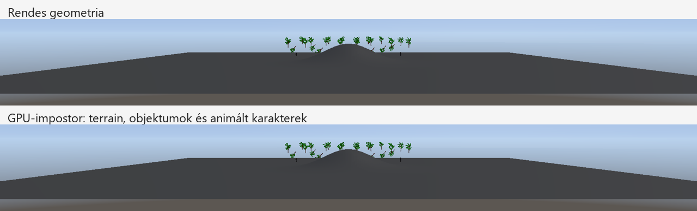

# Jelenetszintű impostorok – 2026-10-09

A korábbi faatlasz mellett a renderer távoli statikus objektumokat, terrain-chunkokat és animált karaktereket is helyettesíthet GPU-n készített HDR-szín- és mélységképpel. A Scene View, Game View és az editor nélküli játék ugyanazt a rendszert használja. Az eredeti modellek, fizika és jelenetadatok megmaradnak.

**2026-10-10-es bővítés:** kis kamerafordulás közben már mélységi újravetítést használunk. A részletes feltételek és új ellenőrzések: [impostorok kamerafordulás közben](impostor-reprojection-20261010.md). A lap alján szereplő 2026-10-09-es mérések az akkori, álló kamerás változatra vonatkoznak.

## Két egymást kiegészítő út

| Út | Használat | Kameramozgás |
|---|---|---|
| Előre készített többirányú modellatlasz | Fák és más statikus, natív materialokat használó modellek | Menet közben is használható; a meglévő nézet-, material- és transzformációs korlátozásokkal |
| GPU-s nézeti impostor | Terrain, statikus objektumok és a karakter aktuális animált póza | Változatlan helyről kis kamerafordulással is használható; helyváltozáskor rendes geometria |

Az Asset Browser modellmenüje **Bake model impostor** és **Disable model impostor** néven jelenik meg. A bake már nem követel két bark/leaf materialt: 1–128 natív alapértelmezett materialslot támogatott. Az importált statikus modellek a renderer által támogatott formátumokból tölthetők be. Az animált modellekhez a menet közbeni GPU-s út tartozik. A régi fa-sidecarok és a Tree Generator mentése kompatibilisek maradnak.

A modellatlasz három textúrája, relatív függőségei és a csomagolása a [fa-impostor dokumentumban](tree-impostors-20261009.md) szerepel. A bake elutasítja a Blend, unlit és emissive materialt. A GPU-s nézeti impostor a rendes shader eredményét rögzíti, így az opaque/masked objektumok emissive, unlit, HDR és material override megjelenése is megőrizhető.

## GPU-s renderelés

Az impostor a forrásnézet egész pixelekre illesztett kivágását tartalmazza. A HDR-képet és a valódi pixelenkénti mélységet két háromszög rajzolja vissza. Az üres pixelek eldobódnak; a terrain mögötti karakterek és az alfa-kivágások takarását nem egy lapos quad mélysége dönti el. A tone mapping az összerakott jelenetre egyszer történik meg.

A távoli terrain-chunkok egy közös képsávot használhatnak. A frissítéskor a látható eredeti chunkok rajzolódnak a kivágásba, a közeli/natív határ folytonosságát is megőrizve; újrafelhasználáskor a távoli csoport egyetlen impostor draw. Csak az egyenként is alkalmas, teljesen képernyőn belüli távoli chunkok kerülnek a helyettesített csoportba. A közeli és kihagyott chunkok rendesen rajzolódnak. A terrain Performance-számláló a helyettesített chunkok számát mutatja, nem a quadokét.

A karakter befoglaló doboza a csontok vertex-befolyási tartományait és az aktuális CPU-n már rendelkezésre álló csontmátrixokat használja. A GPU-ról nincs póz- vagy képolvasás. A póz legfeljebb 1/60 másodpercig marad újrafelhasználható; nem egy befagyasztott T-póz helyettesíti a karaktert.

## Alapértékek és érvénytelenítés

| Beállítás | Érték |
|---|---:|
| Objektum/terrain távolság a legközelebbi befoglalófelülettől | 180 m |
| Karakter távolság | 80 m |
| Egyedi megjelenített kivágás legnagyobb mérete | 256 × 256 pixel; rögzítési szegéllyel/buckettel legfeljebb 288 × 288 |
| Összevont terrain-sáv | Legfeljebb a nézet szélessége × 256 pixel |
| Helyváltozás/nagy kameraváltás vagy fényváltozás utáni várakozás | 50 ms; kis körbenézés megszakítás nélkül |
| Statikus kép maximális életkora | 100 ms |
| Karakterkép maximális életkora | 16,67 ms |
| Frissítési keret | 16 kép/frame, a két nézet együtt |
| Cache-bejegyzések felső korlátja | 512 |
| Cache-ben tartott GPU-képallokációk felső korlátja | 64 MiB, a még használatban levő régi képekkel együtt |

A Vulkan memóriaigényt a tényleges dedikált képallokációból számoljuk, igazítással együtt. A kis descriptor/pipeline-erőforrások nem részei a képkeretnek. A ritkán használt képek 120 frame után kerülnek ki; felszabadítás előtt további négy frame várakozás védi a folyamatban levő GPU-parancsokat. A keret elfogyásakor az eredeti geometria rajzolódik.

A kamera helyváltozása, nézetméret vagy célkép változása érvényteleníti a nézeti cache-t. Kis körbenézéskor a lefedett képek újravetíthetők. Az objektum transzformációja, materialja/override-ja, tintje és LOD-konfigurációja a saját kulcs része. Terrain-sculpt, splatfestés, paletta és materialparaméter változása új képet kér. A nap, ambient, pont- és spotlámpák renderértékeinek módosulása is érvénytelenít. A frissítési keretbe nem férő érvénytelen képet nem jelenítjük meg korlátlan ideig: a rendes renderer veszi át.

## Lefedettség és jelenlegi korlátok

| Látható tartalom | Jelenlegi működés |
|---|---|
| Távoli opaque/masked statikus modell | Modellatlasz vagy GPU-s nézeti impostor |
| Távoli terrain, splat és triplanar material | GPU-s nézeti impostor, összevont chunkokkal |
| Távoli animált karakter | GPU-s pózkép, legfeljebb 60 Hz-es frissítéssel |
| Közeli, kijelölt, túl nagy vagy képszélt átlépő geometria | Rendes geometria |
| Terrain szerkesztőecset és walkability nézet | Rendes terrain |
| Blend material, víz, részecske, égbolt, UI | Meglévő renderer; nincs általános impostor-helyettesítés |
| Árnyék és tükröződés | Meglévő geometria, LOD és árnyék-cache |

Ez még nem a kamera helyváltozása alatt is működő, teljes világra kiterjedő HLOD-rendszer. Az azonos helyről történő kis körbenézéshez a nézeti mélységkép újravetíthető; sétáló/orbitáló kameránál térbeli HLOD vagy a feltáruló felületek külön kezelése szükséges. A víz és Blend objektumok tetszőleges hátterű helyettesítéséhez külön átlátszó rétegkezelés kell.

A karakter animációértékelése és compute skinningje továbbra is lefut, mert az árnyék és tükröződés a rendes mesh-t használja. A nyereség itt a fő nézet geometriájának és pixelshaderének kiváltásából származik. Statikus impostoron a mozgó árnyék vagy időfüggő megjelenés legfeljebb 100 ms késést kaphat; a közvetlen forrás- és fényváltozás külön érvénytelenít.

## Kapcsolók és ellenőrzés

- `IX_SCENE_IMPOSTORS=0`: a GPU-s nézeti rendszer kikapcsolása indítás előtt.
- `IX_SCENE_IMPOSTORS=1`, illetve hiányzó változó: automatikus teljesítményválasztás.
- `IX_SCENE_IMPOSTORS=2`: kényszerített GPU-cache, az automatikus választás nélkül. A távolsági, kamera-, memória- és minőségi feltételek ekkor is érvényesek.
- `IX_TREE_IMPOSTORS=0`: az előre készített modell/faatlaszok kikapcsolása.
- Mindkettő alapból bekapcsolt. Az összehasonlításhoz ugyanazt a jelenetet, kamerát, felbontást és async present beállítást kell használni.
- A Performance panel **Runtime impostors** sora az objektumokat, terrain-chunkokat és karaktereket, az **Impostor image cache** a képek GPU-memóriáját mutatja. A két nézet számai összeadódnak.
- A `[VIEW-IMPOSTOR]` napló a frissítések, keret miatti visszaesések és az újrafelhasználással kiváltott forrásháromszögek számát is tartalmazza. A capture frame geometriája nem számít megtakarításnak.

Az automatikus mód kompatibilis kamera és változatlan megvilágítás mellett először a rendes renderelés, majd a cache teljes frame-cadenciáját méri. Mindkét szakasz legalább 0,75 másodperc és 32 minta; az első 50 ms feltöltési/pipeline-bemelegítése kimarad. Az utolsó legfeljebb 512 minta mediánját hasonlítja össze. Legalább 2% javulás és tényleges impostorrajzolás kell az aktív állapothoz. Máskülönben visszatér a rendes geometriához, és 10 másodperc múlva újra próbál. Kameraelmozdulás, nagy vetítésváltozás, fényváltozás vagy hosszú szünet új kalibrációt kér; kis körbenézés nem. A naplóban a `policy=calibrating/trial/enabled/geometry/forced` mutatja az állapotot. Ez futásidejű becslés: a fizika, UI és más terhelés változása is befolyásolja.

## 2026-10-09-es ellenőrzések

A végleges editor és editor nélküli runtime Debug/Release build sikeres; mind a négy konfigurációban 12/12 CTest sikeres. A geometriai kivágás, frissesség és automatikus választás tesztje a `ViewImpostorTest`, 31 ellenőrzéssel. A `TreeImpostorTest` 38 ellenőrzése egymaterialos és többmaterialos modellbake-et, materialszám-eltérést, kimeneti lenyomatokat és a forrásmesh megőrzését is ellenőrzi.

Saját tesztprojektben 24 statikus objektum, 40 távoli terrain-chunk és 3 Ozz-animált karakter működött egyszerre. A dombos terep eredeti és impostoros GPU-képeinek terrain-pixelei azonosak; a különbség a fák és eltérő pillanatban mintavett karakterpózok környezetére korlátozódott. A két impostoros képkocka között a karakterek alakja változott, az animáció nem fagyott be.

Az ideiglenes kameramozgatási tesztben mozgás alatt nincs impostorhasználat, megállás után visszatér. Objektumtranszformáció változásakor új capture készült. Egy karakter letiltásakor a számláló 3-ról 2-re váltott, visszakapcsolásakor ismét 3-ra. A Debug runtime Vulkan- és szinkronizáció-validációja ezekben a futásokban nem jelzett VUID vagy SYNC-HAZARD hibát. A képolvasási és mozgatási mérőkód kikerült a végleges forrásból. Az editor menüpontját egérrel nem automatizáltam.

## Teljesítménymérés

A kalibráció nélküli, aktív GPU-cache 1024 × 1024 cellás, 1 m-es terrainnel, 24 modellel és 3 animált karakterrel 968-ról 1114 FPS-re gyorsított (+15,1%). A jelenet GPU-ideje 0,527-ről 0,354 ms-ra, a terrainé 0,391-ről 0,295 ms-ra csökkent. A CPU renderideje ugyanakkor 0,136-ról 0,232 ms-ra nőtt.

A könnyebb, 256 × 256 cellás dombos jelenetben a bekapcsolt cache 1493-ról 1383 FPS-re csökkentett (−7,4%), miközben a GPU jelenetideje 0,237-ről 0,188 ms-ra javult. Az animáció/CPU volt a korlát. Ez indokolja az automatikus módot: az elmentett háromszögek száma vagy a jobb GPU-idő önmagában nem elég a cache bekapcsolásához.

Mind a négy összehasonlító futás 22 másodperces Release runtime, 2560 × 1369 felbontás, bekapcsolt async present és fix kamera mellett történt. A számok az utolsó öt mérési ablak mediánjai. A GPU-s út méréséhez a fák előre készített atlasza ki volt kapcsolva a saját fixture-ben; a meglévő modellatlasz külön nyeresége nincs ezekben a számokban.

A végleges automatikus mód külön, ugyanezekkel a mérési feltételekkel:

| Jelenet / mutató | GPU-cache kikapcsolva | Automatikus mód |
|---|---:|---:|
| 1024 × 1024 cellás terrain, FPS | 972 | 1109 |
| Ugyanott jelenet GPU-ideje | 0,507 ms | 0,341 ms |
| Ugyanott terrain GPU-ideje | 0,375 ms | 0,289 ms |
| 256 × 256 cellás dombos terrain, FPS | 1486 | 1467 |
| Ugyanott jelenet GPU-ideje | 0,238 ms | 0,238 ms |

A nagyobb jelenetben az automatikus mód `enabled` állapotban maradt, és +14,1% FPS-t adott. A könnyebb jelenetben mindkét kalibráció `geometry` állapotot választott; a korábbi −7,4%-os tartós cache-veszteség helyett a fenti futások eltérése −1,3% volt. Az átmeneti próbák és a futások közötti terhelés/órajel-változás miatt ez nem jelent minden jelenetre garantált, nulla költségű választást. A GPU-cache az üres editorra és mozgó kamerára nem ígér 6500–7000 FPS-t.

Az automatikus futások a `Client/build/followup-audit-20261008/view-impostor-adaptive-{group,light}-{off,on}-20261009/` könyvtárakban vannak. A mérési ablakok alatt nem futott build vagy teszt a háttérben.

A nyers naplók a `Client/build/followup-audit-20261008/view-impostor-{group,light}-{off,on}-final-20261009/` alatt vannak. A saját fixture és a képkimenetek: `Client/build/view-impostor-audit-20261009/`.
