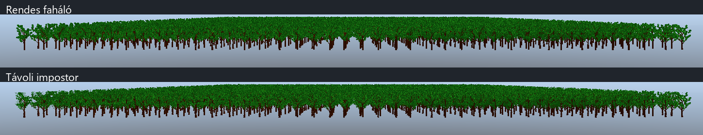

# Távoli fák impostorai

A Tree Generator által mentett fák távoli példányai több irányból készített atlaszt használhatnak a teljes háló helyett. A közelben a rendes modell marad. A megoldás a Scene View, Game View és az editor nélküli játék rendererében is működik.

## Használat

- Új fa: a Tree Generatorban alapból bekapcsolt **Bake distant-tree impostor** opcióval válaszd a **Save as Asset** műveletet.
- Meglévő fa vagy más statikus modell: az Asset Browser modellmenüjéből válaszd a **Bake model impostor** műveletet. 1–128 natív alapértelmezett materialslot támogatott. A mesh és a GUID megmarad; az atlasz és a függőségek kerülnek mellé. A betöltött renderer következő frame előtt frissül.
- Egy modellatlasz kikapcsolása: **Disable model impostor** ugyanebben a menüben. Az atlaszfájlok megmaradnak, így később újra elkészíthető. A renderer a modellatlasz helyett visszatér a forráshoz; a külön GPU-s nézeti rendszer ettől még működhet.
- Összehasonlító mérés: indítás előtt `IX_TREE_IMPOSTORS=0` kikapcsolja a használatukat. Alapból bekapcsoltak; a változó csak az adott folyamatot érinti.

A generátorban az **Impostor distance**, **Transition range** és **Atlas view size** állítható. Alapérték: 180 m, 30 m átmenet, 256 pixel nézetenként. A váltás a fa középpontjától mért távolságot használja, és az egyenletes példányméretezéssel együtt skálázódik. Egy kétszeres méretű fa alapbeállításokkal 360–420 m között vált.

A meglévő modellek menüből történő bake-je a fenti alapértékeket használja. Az atlasz mentéskor készül; a menet közbeni renderelés nem rendereli újra a nézeteket. Mentés/bake alatt egyszeri CPU-munka és textúrafeltöltés történik.

## Renderelés és adatfájlok

Nyolc vízszintes irányhoz három magassági nézet tartozik: −30°, 0°, +30°. A két szomszédos vízszintes nézet és a mesh közötti átmenetet egymást kiegészítő, képernyőbeli dither tartományok adják. Teljes impostornál egy fa 2–4 színháromszög; az alfa mélységi előpass külön rajzolási művelet. Az atlaszt az azonos modellt használó példányok közösen használják, és instancinggel rajzolódnak.

Az albedo/alfa, a normál és az AO/roughness/metallic atlasz a material színét, UV-transzformációját, alfa-kivágását és normáltérképét is feldolgozza. A nap és a lámpák az aktuális megvilágítást adják; a napfény nincs a színatlaszba sütve. A normálatlaszhoz a kis atlasz-UV-k tangensét is megtartja a shader.

Egy `Oak.glb` modell mellé az `Oak.glb.impostor.json` és az `Oak_impostor/` könyvtár kerül. Ebben három PNG, `billboard.gltf` és `billboard.bin` van. A modell `.meta` fájlja felsorolja a függőségeket. A hivatkozások relatívak, a szokásos játékcsomagolás az Assets könyvtárral együtt viszi őket.

Betöltéskor a forrásmodell, materialok, textúrák és az atlaszkimenetek tartalomlenyomata ellenőrződik. Menet közben az élő materialértékek változása és a fájlok módosítási ideje is érvényteleníti az atlaszt. A nagy atlaszok nem olvasódnak újra minden frame-ben. Új bake után a betöltött impostor is újratöltődik, a GPU befejezett munkája után.

## Korlátok

A későbbi terrain-, objektum- és karakterbővítés, valamint a két rendszer külön kikapcsolása a [jelenetszintű impostor dokumentumban](scene-impostors-20261009.md) szerepel.

- Hiányzó vagy módosított forrás/atlasz esetén a rendes mesh rajzolódik. Material vagy textúra változtatása után új bake szükséges.
- Eltérő példánymaterial vagy aktív material override, nem egyenletes/negatív scale, illetve X/Z irányú döntés esetén az adott példány rendes mesh marad. Y irányú elforgatás és egyenletes scale támogatott.
- ±45°-nál meredekebb kameranézetben a rendes mesh marad. A magassági nézetek közül a legközelebbi választódik; a sorok között jelenleg nincs folyamatos átkeverés.
- Blend, unlit és emissive materialnál a bake figyelmeztet, és a modell atlasz nélkül használható. Az atlasz RGBA8: HDR albedók és a teljes fa térbeli mélysége nem reprodukálódnak pontosan.
- Az árnyékvetés a meglévő mesh/árnyék-LOD/cache útvonalon marad. A közeli fák levélkártyáinak költségét ez a fejlesztés nem csökkenti.

Az atlasz három tömörítetlen RGBA8 textúrájának alapmérete fa-változatonként 128-as beállítással 4,5 MiB, 256-tal 18 MiB, 512-vel 72 MiB; teljes mip-lánccal nagyjából 6/24/96 MiB. Sok különböző távoli fa esetén a 128-as felbontás csökkenti a memóriaigényt.

## Ellenőrzés, 2026-10-09

Editor és editor nélküli runtime Debug/Release build: sikeres. Mind a négy konfigurációban 11/11 CTest sikeres; az új `TreeImpostorTest` 32 ellenőrzést tartalmaz. Többek között az alfa mögötti geometriát, az átlátszó széleket, a normáltérkép irányát, hibás metaadatokat, hiányzó/módosított atlaszt, projektáthelyezést és meglévő modell meshét megőrző bake-et ellenőrzi.

A GPU-ból kiolvasott képeken ellenőriztem az alfa-kivágást és a vegyes közeli/átmeneti/távoli jelenetet. A Debug runtime Vulkan- és szinkronizáció-validációja nem jelzett hibát a vizsgált jelenetben, az impostor újratöltése után sem. Az ideiglenes képrögzítő és újratöltést kiváltó mérőkód kikerült a végleges forrásból. A menüpontokat automatizált egérkattintással nem teszteltem.

A teljesítménymérés külön tesztprojektben, fix kamerával, 2000 egyenletes méretű, 240–632 m-re elhelyezett fával történt. Egy forrásfa 6472 háromszög; a kikapcsolt futás a korábbi bark-LOD-t is használja. Az impostoros fő nézet naplója 2000 fát, 8000 színháromszöget és két draw callt mutatott. A fák az árnyéktávolságon túl voltak. A mérés eredménye nem vetíthető közvetlenül közeli erdőre vagy az üres editor FPS-ére.

| Végleges Release runtime, az utolsó 5 mérési ablak mediánja | Impostor kikapcsolva | Impostor bekapcsolva |
|---|---:|---:|
| FPS | 231 | 634 |
| Jelenet GPU-ideje | 3.943 ms | 0.495 ms |

Az FPS növekedése ebben a jelenetben 2.74×. Mindkét futás 22 másodpercig tartott, a háttérben fordítás és tesztfuttatás nélkül, azonos 2560×1369 felbontással és bekapcsolt async presenttel.

A nyers mérési naplók a `Client/build/followup-audit-20261008/tree-impostor-{off,on}-final-20261009/` könyvtárakban vannak. A tesztprojekt: `Client/build/tree-impostor-audit-20261009/project/`. A `[TREE-IMPOSTOR]` naplósor megmutatja, hány fa váltott át ténylegesen.
